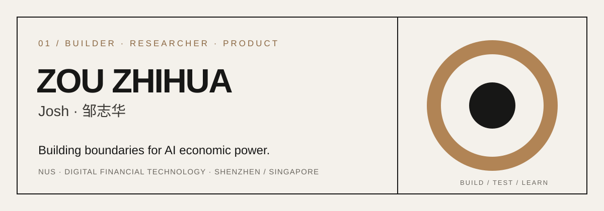

<p align="right"><strong>EN</strong> &nbsp;·&nbsp; <a href="README.zh-CN.md">中文</a></p>

<picture>
  <source media="(prefers-color-scheme: dark)" srcset="assets/hero-n1-dark.svg">
  <source media="(prefers-color-scheme: light)" srcset="assets/hero-n1-light.svg">
  
</picture>

<p align="center">
  <a href="mailto:zouzhihuajosh@outlook.com">Email</a> &nbsp;·&nbsp;
  <a href="https://www.linkedin.com/in/zouzhihuajosh">LinkedIn</a> &nbsp;·&nbsp;
  <a href="https://joshuazou-web.github.io/money-ai-is-allowed-to-move/en/">Book</a> &nbsp;·&nbsp;
  <a href="https://github.com/joshuazou-web?tab=repositories">All work</a>
</p>

## 01 / The question

I have worked across economics, venture scouting, investment research, FinTech products, AI hardware commercialization, and software. They gradually led me to one question:

> ### As AI learns to earn, spend, invest, sign contracts, and control assets, how do we keep its economic power bounded, auditable, and ultimately under human control?

I call this direction **AI Economic Governance**. I am writing about it, building prototypes, and looking for real situations where the idea can be tested.

## 02 / Start here

<table>
<tr>
<td width="50%" valign="top">

### The Money AI Is Allowed to Move

**A short book and working thesis.**

An L0–L4 framework for how much economic authority AI should receive, based on liability and control—not just model capability.

[Read online →](https://joshuazou-web.github.io/money-ai-is-allowed-to-move/en/)

</td>
<td width="50%" valign="top">

### CrossBorder AML RiskOps

**A working product prototype.**

When 900 accounts trigger alerts and a team can review only 60, the system prioritizes evidence while keeping the final decision with a human.

[View repository →](https://github.com/joshuazou-web/crossborder-riskops)

</td>
</tr>
</table>

## 03 / Selected builds

| Build | The real question | Evidence |
| --- | --- | --- |
| **[CorridorOS](corridor-os/README.md)** | Once a Chinese company opens in Singapore, who is allowed to decide each movement of its money—and what evidence stands behind that decision? | 21 payment rules · 6 AML typologies · 124 tests · 7 end-to-end scenarios · hash-chained audit |
| **[CrossBorder AML RiskOps](https://github.com/joshuazou-web/crossborder-riskops)** | Which alerts deserve human attention—and what must AI never decide? | 6,000 synthetic transactions · 20 rules · 453 tests · 97.01% recall |
| **[WealthGuard Proofline](https://github.com/joshuazou-web/wealthguard-proofline)** | How can a financial answer prove where every important claim came from? | 13 official documents · 1,714 evidence chunks · 165 regression and citation checks |
| **[ThinkBeforeClick FinSafe](https://github.com/joshuazou-web/think-before-click-product-case)** | Can safety appear in the final seconds before money moves? | 243 locked cases · deterministic intervention · amount-aware business controls |

<details>
<summary><strong>More experiments</strong></summary>

<br>

- **[Converge](https://github.com/joshuazou-web/techjam-converge)** — an interpretable shopping agent that asks the question most likely to reduce uncertainty; 0.976 technical score with zero model tokens.
- **[OpsSignal](https://github.com/joshuazou-web/opssignal)** — routes 3,600 synthetic operations tickets using confidence gates and a human-review queue.
- **[DEBUG.CN](https://github.com/joshuazou-web/mandarin-openai-api-debugging-copilot)** — turns API failures into evidence, root causes, minimal fixes, and verification steps for Mandarin-speaking developers.
- **[Agent Control Plane](https://github.com/joshuazou-web/agent-control-plane)** — makes an agent's authority executable through default-deny policy, approval gates, budgets, and audit trails.

</details>

## 04 / How I work

```text
real problem
    ↓
explicit assumptions and authority boundaries
    ↓
smallest complete product loop
    ↓
evaluation, failure analysis, human review
    ↓
publish the result — and where it stops being valid
```

I use AI to help with research, code, and first drafts. I remain responsible for the product judgment, evaluation design, evidence, and the decision about what the system is allowed to do.

## 05 / The path here

- **NUS** · MSc Digital Financial Technology · 2025–2027
- **Huatai International** · FinTech Product Intern · translated financial rules into product requirements
- **Sequoia China** · Investment Research Analyst · studied technology and cybersecurity companies
- **MiraclePlus** · Campus Scout · met young founders and evaluated early ideas
- **AI Star** · Investor & Product Commercialization Lead · worked with customers, factories, product cost, pricing, and delivery

The path is not perfectly straight. The question is becoming clearer.

---

<p align="center">
  <strong>I am looking for people who want to challenge this question—or build something around it.</strong><br><br>
  <a href="mailto:zouzhihuajosh@outlook.com">zouzhihuajosh@outlook.com</a>
</p>
