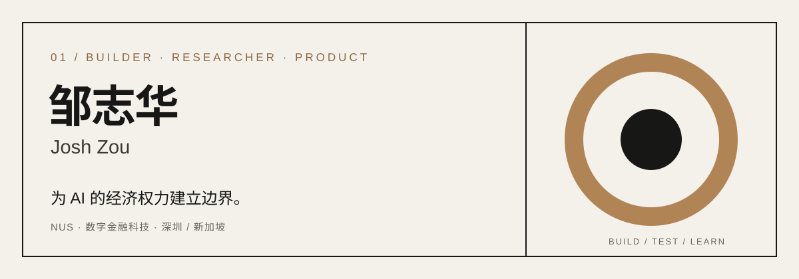

<p align="right"><a href="README.md">EN</a> &nbsp;·&nbsp; <strong>中文</strong></p>

<picture>
  <source media="(prefers-color-scheme: dark)" srcset="assets/hero-n1-dark-zh.svg">
  <source media="(prefers-color-scheme: light)" srcset="assets/hero-n1-light-zh.svg">
  
</picture>

<p align="center">
  <a href="mailto:zouzhihuajosh@outlook.com">邮箱</a> &nbsp;·&nbsp;
  <a href="https://www.linkedin.com/in/zouzhihuajosh">LinkedIn</a> &nbsp;·&nbsp;
  <a href="https://joshuazou-web.github.io/money-ai-is-allowed-to-move/">书</a> &nbsp;·&nbsp;
  <a href="https://github.com/joshuazou-web?tab=repositories">全部作品</a>
</p>

## 01 / 我在追的问题

我做过经济学、早期项目寻找、投资研究、金融科技产品、AI 硬件商业化和软件开发。这些经历逐渐把我带到同一个问题：

> ### 当 AI 可以自己赚钱、花钱、投资、签合同和控制资产，我们怎样确保它的经济权力始终有边界、可审计，并最终由人控制？

我把这个方向叫作 **AI Economic Governance（AI 经济治理）**。我正在写、做原型，也在寻找能真正检验这个想法的现实场景。

## 02 / 从这里开始

<table>
<tr>
<td width="50%" valign="top">

### 《AI 被允许动的钱》

**一本小书，也是一套还在生长的假设。**

它提出 L0–L4 经济权限框架：不只看模型有多强，而是看它能承担什么责任、获得多少控制权。

[在线阅读 →](https://joshuazou-web.github.io/money-ai-is-allowed-to-move/)

</td>
<td width="50%" valign="top">

### CrossBorder AML RiskOps

**一个可以运行的产品原型。**

当 900 个账户触发预警、团队每天只能调查 60 个时，系统负责整理和排序证据，最终决定仍然留给人。

[查看项目 →](https://github.com/joshuazou-web/crossborder-riskops)

</td>
</tr>
</table>

## 03 / 代表作品

| 作品 | 它真正回答的问题 | 可验证的结果 |
| --- | --- | --- |
| **[CorridorOS](corridor-os/README.zh-CN.md)** | 中国企业进入新加坡后，每一笔资金的决定由谁来做，背后又有什么证据？ | 21 条支付规则 · 6 种 AML 模式 · 124 个测试 · 7 个端到端场景 · 哈希链审计 |
| **[CrossBorder AML RiskOps](https://github.com/joshuazou-web/crossborder-riskops)** | 哪些风险预警值得人优先处理？哪些决定绝不能交给 AI？ | 6,000 笔合成交易 · 20 条规则 · 453 个测试 · 97.01% 召回率 |
| **[WealthGuard Proofline](https://github.com/joshuazou-web/wealthguard-proofline)** | 一个金融答案怎样证明每项重要结论从哪里来？ | 13 份官方文件 · 1,714 个证据块 · 165 项回归与引用检查 |
| **[ThinkBeforeClick FinSafe](https://github.com/joshuazou-web/think-before-click-product-case)** | 安全提示能否出现在钱真正转出去之前的最后几秒？ | 243 个锁定案例 · 确定性干预 · 考虑金额的企业支付控制 |

<details>
<summary><strong>更多实验</strong></summary>

<br>

- **[Converge](https://github.com/joshuazou-web/techjam-converge)**：用可解释规则寻找最能减少不确定性的下一问；不用模型，技术评分 0.976。
- **[OpsSignal](https://github.com/joshuazou-web/opssignal)**：根据置信度分流 3,600 条合成运营工单，把不确定案例交给人工复核。
- **[DEBUG.CN](https://github.com/joshuazou-web/mandarin-openai-api-debugging-copilot)**：把 API 报错转化为证据、根因、最小修复与验证步骤。
- **[Agent Control Plane](https://github.com/joshuazou-web/agent-control-plane)**：用默认拒绝、审批、预算与审计记录，把 Agent 的权限从一句提示词变成可执行规则。

</details>

## 04 / 我怎样做东西

```text
一个真实但模糊的问题
        ↓
明确假设、权限与失败边界
        ↓
做出最小但完整的产品闭环
        ↓
评测、分析失败、引入人工复核
        ↓
公开结果，也公开结果在哪里失效
```

我会用 AI 辅助研究、代码和初稿，但产品判断、评测设计、证据，以及系统到底可以做什么，由我负责。

## 05 / 我怎样走到这里

- **新加坡国立大学** · 数字金融科技硕士 · 2025–2027
- **华泰国际** · 金融科技产品实习生 · 把复杂金融规则转化为产品需求
- **红杉中国** · 投资研究实习生 · 研究科技与网络安全公司
- **MiraclePlus** · Campus Scout · 寻找年轻创业者，判断早期想法
- **AI Star** · 投资人兼产品商业化负责人 · 参与客户、工厂、成本、定价与交付

这条路并不完全笔直，但我想解决的问题正变得越来越清楚。

---

<p align="center">
  <strong>如果你也想挑战这个问题，或者一起做点什么，欢迎找我。</strong><br><br>
  <a href="mailto:zouzhihuajosh@outlook.com">zouzhihuajosh@outlook.com</a>
</p>
