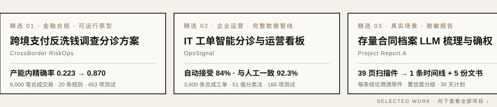

<p align="right"><a href="README.md">EN</a> &nbsp;·&nbsp; <strong>中文</strong></p>

<h1 align="center">邹志华 Josh</h1>

<p align="center">
  <strong>求职意向：AI 解决方案 ｜ 金融科技 · Agent 落地</strong><br>
  新加坡国立大学 数字金融科技硕士（2027 届）· 深圳 / 新加坡
</p>

<p align="center">
  <a href="mailto:zouzhihuajosh@outlook.com">邮箱</a> &nbsp;·&nbsp;
  <a href="https://www.linkedin.com/in/zouzhihuajosh">LinkedIn</a> &nbsp;·&nbsp;
  <a href="assets/zhihua-zou-ai-product-business-casebook-zh-cn.pdf">案例集 PDF</a> &nbsp;·&nbsp;
  <a href="https://joshuazou-web.github.io/money-ai-is-allowed-to-move/">《AI 被允许动的钱》</a> &nbsp;·&nbsp;
  <a href="https://github.com/joshuazou-web?tab=repositories">全部仓库</a>
</p>

<a href="#01--精选三项">
  <picture>
    <source media="(prefers-color-scheme: dark)" srcset="assets/featured-marquee-zh-dark.svg">
    <source media="(prefers-color-scheme: light)" srcset="assets/featured-marquee-zh-light.svg">
    
  </picture>
</a>

我把一句模糊的业务需求，拆成**规则、状态、权限和验收口径**，再交付一套对方能当场检查的方案：可运行的原型、可复算的评测，以及一份写清楚“在哪里失效”的说明。

**18 个项目** · 14 个公开仓库 · 2 份真实场景脱敏报告 · 覆盖跨境支付合规、证券研究、企业运营、Agent 安全与线下业务落地

> 标注说明：**真实场景** = 在真实业务中使用的交付物（已脱敏）；**合成数据原型** = 可运行、可复现，但未在生产环境运行；**团队项目** = 只写我本人负责的部分。

## 01 / 精选三项

<table>
<tr>
<td width="33%" valign="top">

**跨境支付反洗钱调查分诊方案**<br>
<sub>CrossBorder RiskOps · 合成数据原型</sub>

**痛点**：告警看不完，调查员只能按时间或金额顺序打开案件。

**方案**：20 条确定性规则检测 + 8 因子可解释排序 + 四档路由；AI 只做带引用的证据摘要，代码层没有处置权。

**结果**：同等人力下，产能内精确率 **0.223 → 0.870**；边界探针 0/34 被突破。

[仓库 →](https://github.com/joshuazou-web/crossborder-riskops)

</td>
<td width="33%" valign="top">

**IT 工单智能分诊与运营看板**<br>
<sub>OpsSignal · 合成数据原型</sub>

**痛点**：团队说不清负载压在哪，分类靠当天谁值班，之前的 AI 分诊没人信。

**方案**：先定义 51 值分类法，再建数据仓库与看板，最后才上带置信度门控的 AI 分诊。

**结果**：**84%** 工单自动接受，与人工一致率 **92.3%**；不确定的交给人，不硬猜。

[仓库 →](https://github.com/joshuazou-web/opssignal)

</td>
<td width="33%" valign="top">

**存量合同档案 LLM 梳理与确权**<br>
<sub>Project Report A · 真实场景</sub>

**痛点**：约 10 份手写、残缺的合作建房协议，谁拥有什么说不清。

**方案**：LLM 抽取与结构化 + 逐条对照原件核验 + 置信度分级，法律步骤交给持证专业人士。

**结果**：**39 页扫描件 → 1 条时间线 + 5 份文书草案 + 30 天计划**。

[报告 PDF →](evidence/Project_Report_A_Legacy_Rights_Consolidation.pdf)

</td>
</tr>
</table>

## 02 / 全部项目

<!--
新项目加在本节最上面，照下面的模板写：

#### 方案名（按 AI 解决方案岗位的说法命名）
`原项目名` · 个人 / 团队项目 · 真实场景 / 合成数据原型 · [仓库 →](链接)

- **背景与目标**：谁、在什么场景、遇到什么问题；要达成什么。
- **我的职责**：我本人做了什么（团队项目写清楚分工）。
- **交付与成果**：交付了什么 + 可核验的数字；写明结果的性质（实测 / 测算 / 合成评测）。

如果它进了精选三项，同时改 scripts/build_featured_marquee.py 里的 FEATURED 并重新运行，再更新上面的 01 表格。
-->

#### 存量合同档案的 LLM 辅助梳理与确权方案
`Project Report A` · 个人主导 · 真实场景（家族委托，草案阶段） · [报告 PDF →](evidence/Project_Report_A_Legacy_Rights_Consolidation.pdf)

- **背景与目标**：一个家族 2008–2018 年间通过合作建房协议积累了多处物业权益，依据只有约 10 份协议与申请记录、39 页扫描件（多处手写、残页），继承状态未核实，也没有统一的管理主体。目标是把散乱纸档变成一份有出处、可交给律师复核的权属判断和行动计划。
- **我的职责**：担任分析与统筹：收集原件，设计 LLM 抽取与结构化流程，逐条对照扫描原图核验 AI 产出，决定置信度等级与行动顺序；法律意见、公证、税务与登记明确交给持证专业人士。
- **交付与成果**：1 条覆盖 4 个地块的 2008–2018 时间线；5 份带置信度标注的文书草案（含 13 条款、5 个附件的确认协议）；3 条工作线的 30 天计划，列出 7 项信息缺口和 10 项风险对策。核验时拦下了 AI 把“拟议分配”写成“已确认”的错误。目前是草案，尚未签署。

#### 小微餐饮档口的 AI 辅助开业方案
`Project Report B` · 个人主导 · 真实场景（首店验证期） · [报告 PDF →](evidence/Project_Report_B_Micro_Retail_Launch.pdf)

- **背景与目标**：一家家族餐饮计划在县级市商场入口试点一个 16.8 m² 的熟食档口。决策人不在现场，手里只有一张标注照片和两段语音；预算封顶在数万元；排烟、电力、排水由房东控制，都还没有书面确认。目标是做出施工方能照着做、能过食品安全要求、之后可以复制的开业方案。
- **我的职责**：定义方案规格，用 AI 工具把现场碎片整理成模块和参数，编写控制工作簿和两份业务文件，并逐项对照现场信息与公开规则核验。现场勘查、电气和排烟设计的签字不在我的范围内。
- **交付与成果**：17 个带尺寸的功能模块和 9 个公用系统规格；7 张表的预算与采购工作簿（15 个施工项，设备 17 项采购、3 项暂缓）；4 道开工前闸门和 16 项开业验收清单，规定“闸门不过就停止采购，稳定 3 个月才复制”。首店在验证期，这些交付物是施工和开业的工作依据。

#### 跨境支付反洗钱调查分诊方案
`CrossBorder RiskOps` · 个人项目 · 合成数据原型 · [仓库 →](https://github.com/joshuazou-web/crossborder-riskops)

- **背景与目标**：反洗钱团队真正的瓶颈不是“发现异常”，而是“看不完”：原始告警精确率低，调查员只能按时间或金额顺序打开案件。目标是在人力不变的情况下，把每天能查的那一批换成最该查的，并且让调查员能当场推翻任何一次排序。
- **我的职责**：独立完成场景拆解（调查员、支付运营、客服、运营主管、审计 5 个角色），设计规则、排序、人机权限边界与评测方案，并实现前后端。
- **交付与成果**：8 状态支付内核，20 条确定性规则（9 个信号族、6 类洗钱手法），8 因子可解释排序和四档路由；AI 只做带引用的摘要和冲突提示，代码层没有处置权限。在 6,000 笔合成交易上，告警漏斗 1,638 → 957 → 693 → 242，产能内精确率 0.223 → 0.870；边界探针 0/34 被突破，提示注入拦截 12/12、误伤 0/6；453 项自动化测试，附中文演示视频。

#### 证券研究问答的证据与质检层
`WealthGuard Proofline` · 个人项目 · 合成数据原型 · [仓库 →](https://github.com/joshuazou-web/wealthguard-proofline)

- **背景与目标**：券商和财富平台的 AI 问答，最危险的不是荒谬的回答，而是信息不够时依然说得很确定的回答：跳过持有期限等关键信息、在文字里心算、引用没有日期的来源。目标是在回答被信任之前，先把它变成一条可以逐条检查的研究轨迹。
- **我的职责**：定义产品边界（不做交易、不做预测、不承诺收益），设计意图分类与澄清策略、确定性策略引擎、证据血缘与校验和方案、16 类错误分型的质量运营，并完成 React + FastAPI 实现和全部评测。
- **交付与成果**：六步研究流程：识别任务 → 只问信息价值最高的一问 → 策略放在模型之外 → 取带日期的原文 → 算术走测试过的代码 → 留下完整轨迹。13 份 SEC / HKEX / SZSE / CSRC 官方原件切成 1,714 个带校验和的证据块；分类回归 126/126、官方引用溯源 39/39 全部通过。数据为合成，不构成投资建议。

#### B2B Agent 故障排查与客户沟通演练场
`PropTech Agent Reliability Lab` · 个人项目 · 合成数据练习场 · [仓库 →](https://github.com/joshuazou-web/proptech-agent-reliability-lab)

- **背景与目标**：面试完一个 B2B PropTech 岗位后，我意识到行业新人拿不到公司内部的 Agent 和客户项目。与其虚构经历，不如搭一个安全的模拟环境，把“客户反馈 → 根因 → 修复 → 解释”这条回路公开练一遍。
- **我的职责**：设计模拟的场地分析 Agent、故意注入的失败模式和排查流程，并分别写客户侧和工程侧的文档。
- **交付与成果**：FastAPI + CLI + Streamlit 看板；结构化轨迹存入 SQLite，可以回放；失败可注入、可分类，每个确认的根因都留一条回归测试。客户报告拆成“事实 / 假设 / 未知”并写明验收标准，同一个根因对客户和对工程各写一版说明。数据全部虚构，只证明方法可以迁移。

#### 电商对话式导购：反向用户建模检索
`Converge` · 个人参赛 · TikTok TechJam 2026 · [仓库 →](https://github.com/joshuazou-web/techjam-converge)

- **背景与目标**：常规对话式搜索计算“用户的话和商品有多像”，但在这道赛题里，用户的话本来就是从目标商品生成的。目标是在 10 轮之内，用最少的追问找准商品。
- **我的职责**：重新定义问题，改为反过来问“如果是这个商品，他说得出这句话吗”；设计检索、提问和展示策略，并用官方评测器做消融。
- **交付与成果**：把 50,000 个商品预先展开并建索引，检索变成集合求交；按期望信息增益选下一问，按置信度决定展示几个结果。官方评测 TechnicalScore 0.9760（弱基线 0.1067），Hit@10 1.000，平均 1.96 轮收敛，每轮 7.7 ms，不调用模型；消融显示反向用户模型贡献 0.12 分。结论只在赛题评测协议内成立。

#### IT 工单智能分诊与运营看板方案
`OpsSignal` · 个人项目 · 合成数据原型 · [仓库 →](https://github.com/joshuazou-web/opssignal)

- **背景与目标**：一支内部 IT / 业务技术团队说不清自己的负载压在哪：状态和团队名有好几种拼法，分类取决于当天谁在分诊，之前的 AI 分诊没有置信度也没有复核路径，没人信任。目标是先定义工作，再度量，最后才让模型分诊。
- **我的职责**：设计六维 51 值的分类法（含边界案例与脏别名）、21 张集市表的指标口径、19 项分级校验与回滚策略、AI 分诊的自动接受阈值与弃权规则，并实现运营看板。
- **交付与成果**：在 3,600 条合成工单上跑通清洗 → 数据仓库 → 看板 → AI 分诊。分析发现 50% 已解决工单的根因可以预防（约 9,423 人天），最大的重复请求簇被提了 52 次。分诊准确率 0.842、校准误差 0.048；置信度 ≥ 0.65 的 84.0% 自动接受（与人工一致 92.3%），13.0% 交给人工，3.1% 弃权；166 项自动化测试。

#### Agent 评测结论稳健性审计工具
`DecisiveEval` · 个人项目 · v0.1 研究原型 · [仓库 →](https://github.com/joshuazou-web/decisive-eval)

- **背景与目标**：“A 配置比 B 配置好”的结论，建立在一串没写下来的口径上：基础设施报错算不算失败、要不要计成本、重跑几次取什么统计量。换一个口径，结论可能悄悄翻转。目标是在改线上默认值之前，告诉团队这个结论到底有多稳。
- **我的职责**：设计“规格宇宙”与审计报告字段，编写预注册协议，并公开负结果与失败日志。
- **交付与成果**：CLI 与不可变的证据管线：输入文件 SHA-256、逐口径指标、确定性分层 bootstrap、默认决策一致率、会翻转结论的口径和“最小规格距离”；带失败即关闭预算的 Codex 适配器与公开 JSON Schema。实证回路刻意保持开放，没有用它宣称任何配置更优。

#### 中文开发者 API 报错安全诊断工作台
`DEBUG.CN` · 个人项目 · 可运行 Demo · [仓库 →](https://github.com/joshuazou-web/mandarin-openai-api-debugging-copilot)

- **背景与目标**：开发者习惯把整段报错连同配置一起粘给 AI，既可能泄露密钥和身份信息，拿回来的也是一段没法验证的文字。目标是先脱敏，再给出可以复核的结构化诊断。
- **我的职责**：设计安全默认值、诊断输出结构、报错分类法和公开演示的成本护栏，并实现前后端。
- **交付与成果**：密钥在进入模型之前就被遮盖，浏览器接触不到密钥；每次诊断固定输出证据、置信度、最小修复和验证清单。公开演示设置护栏（每客户端每分钟 3 次、每天 25 次、单次 1,600 token），触线就退回确定性诊断而不是报错；无需密钥的 Demo 模式、双语示例和 20 例公开评测集。

#### 课程答辩 AI 陪练
`白盒 wbox` · 个人项目 · MVP · [仓库 →](https://github.com/joshuazou-web/wbox)

- **背景与目标**：学生用 AI 完成课程设计已经很普遍，问题变成了“交上去的东西，自己讲不讲得明白”。目标是在答辩前找出没懂的地方，逼人讲一遍，而不是去检测是不是 AI 写的。
- **我的职责**：定义产品和伦理边界（只做上台前训练，砍掉实时代答），设计追问题库和雷区规则，实现 Flask 服务和四步向导。
- **交付与成果**：被问预测（20 类高频追问 + 6 类 AI 痕迹雷区）→ 逐题演练 → 答辩讲稿、问答卡和必补清单；模板模式零配置可用，配置密钥后自动启用 LLM 模式。还没有真实用户数据。

#### 编码 Agent 三层安全门禁
`Volc Agent Launchpad` · 个人参赛 · TechJam 2026 · [仓库 →](https://github.com/joshuazou-web/volc-agent-launchpad)

- **背景与目标**：提示词过滤在三种情况下会失效：攻击被改写或换成另一种语言；指令本身善意但实现是破坏性的（“清理一下构建产物”就是 `rm -rf`）；攻击藏在工作区文件里。目标是在三个不同位置拦截，同时不误伤正常开发。
- **我的职责**：拆解威胁场景，设计三层门禁并实现 PolicyGate，编写演示场景和测试。
- **交付与成果**：L1 确定性规则（模型调用前拦截、0 token）+ L2 语义意图分类 + L3 运行时命令与文件内容门禁；Fastify API → PolicyGate → 容器沙箱，每次判定写入结构化 JSON 审计。138 项测试通过，误报 0/65，8 个一键演示场景（2 个放行对照 + 6 个威胁探针）。

#### 支付前反诈干预方案
`ThinkBeforeClick FinSafe` · 个人 P0（基于 5 人团队原型） · 合成数据原型 · [仓库 →](https://github.com/joshuazou-web/think-before-click-product-case)

- **背景与目标**：原来的 ThinkBeforeClick 是 5 人团队做的反钓鱼教育产品。我追加了一个更难的问题：当紧迫、权威、保密或高回报正把人推向不可逆的付款时，学过的东西还会浮现吗？目标是把干预从课堂移到付款前的最后几秒。
- **我的职责**：独立完成 P0（团队原型部分在仓库里单独标注）：风险表示、干预分级策略、AI 权限边界与评测。
- **交付与成果**：10 类诈骗、16 个有来源的风险信号、9 阶段状态模型；确定性策略设定干预等级下限，AI 可以解释但不能下调；每个结果都带理由、引用和具体的核实动作。243 个锁定合成用例（消费者 161 个、企业支付 82 个）、3 条基线对照、保留失败案例；浏览器在线演示，无需密钥。

#### 外汇策略的研究—监控—执行产品化
`Algorithmic FX` · NUS 5 人团队项目 · 合成数据原型 · [仓库 →](https://github.com/joshuazou-web/algorithmic-fx-product-case)

- **背景与目标**：一个能赚钱的信号，和一个别人能安全使用的交易产品之间，隔着数据版本、执行时点、交易成本、操作员控制和监控。目标是把 EUR/USD 双状态策略做成完整的研究工作流原型。
- **我的职责**：团队项目，我不宣称全部产出归我；我提出并推动“研究 / 监控 / 执行必须分离”的产品结构。
- **交付与成果**：用 ADX 在趋势与均值回归两种状态间切换，并在界面上可见；第 t 根收盘形成的目标作用于第 t+1 根；计入 2bp 费用 + 1bp 滑点；数据、下单、环境三道独立的门，生产环境直接拒绝；12 项离线测试和在线产品演示。数据为合成，指标为示意。

#### 风险分驱动的借贷条款设计
`Risk-Based DeFi Lending` · NUS 5 人团队项目 · 在线演示 · [仓库 →](https://github.com/joshuazou-web/risk-based-defi-lending-case-study)

- **背景与目标**：多数“AI 风控”停在一个分数，但借款人关心的是能借多少、利率多少、什么时候会被清算。目标是把风险分翻译成透明、第三方可以复算的借贷规则。
- **我的职责**：负责 Python 风险评分服务和 Flask API；合约与前端是团队产出。
- **交付与成果**：链下算分、链上执行；分数同时驱动最高抵押率、利率、清算线和可借额度（例如分数 20 → 80：抵押率 74% → 56%，利率 5% → 11%）；处理授权更新、分数新鲜度、参数边界和失败场景；在线演示不需要钱包和真实资金。

#### 企业 Agent 权限管控与审计内核
`Agent Control Plane` · 个人项目 · 可用 CLI · [仓库 →](https://github.com/joshuazou-web/agent-control-plane)

- **背景与目标**：在提示词里写“不要删除文件”只是一句请求，不是规则，动作仍然由模型决定要不要发出。部署自主 Agent 的团队需要把权限变成运行时可执行、事后可审计的东西。
- **我的职责**：设计威胁模型与判定顺序、策略 DSL（选 shell glob 而不是正则，让非作者也能读懂并当场反驳）、门禁的一次性与过期语义、审计链方案和 CLI 交互。
- **交付与成果**：零第三方依赖的 Python 内核 + CLI：每个动作判定为放行 / 待批 / 拒绝，未匹配的一律拒绝，禁止规则永远优先；敏感动作等人批准，批准只能用一次且会过期；按任务限制工具调用数和耗时；轨迹和批准日志用链式 SHA-256 防篡改，支持只解释不执行的试运行。尚未经过第三方安全审计。

#### 量化竞赛策略的反过拟合研究协议
`Frozen High-Beta Leader` · 个人参赛 · SoAI 2026 · [仓库 →](https://github.com/joshuazou-web/SoAI-2026-High-Beta-Leader)

- **背景与目标**：任何人都能调出一条漂亮的回测曲线，难的是看到结果后忍住不改参数。目标是给交易竞赛策略设一套“不让自己作弊”的研究协议。
- **我的职责**：设计协议、冻结规则，并完成三个阶段的评估。
- **交付与成果**：只允许 3 个维度可调，在 7 个开发窗口选定后冻结规则；再打开 6 个见过的留出窗口（均值 −6.32%，负结果照样保留），最后一次性打开 18 个新鲜样本外窗口（均值 +10.95%，之后没有改过任何参数）；次日开盘执行，计入 3bp 成本。模拟比赛，不构成投资建议。

#### 自适应反钓鱼培训 SaaS
`ThinkBeforeClick` · NUS 5 人团队项目 · 用户测试 · [产品报告 PDF →](evidence/ThinkBeforeClick_Product_Report.pdf)

- **背景与目标**：2025 年上半年新加坡诈骗报案近 2 万宗、损失 4.56 亿新元；企业反钓鱼培训大多静态、千篇一律，安全团队还要额外维护演练。目标是做一个同时服务个人和企业的自适应反钓鱼培训 SaaS。
- **我的职责**：5 人产品团队成员，参与产品方案、商业模式与用户验证。
- **交付与成果**：基于 AWS Serverless（Lambda、API Gateway、DynamoDB、Cognito 等）的 SaaS，支持钓鱼演练和点击行为分析；3 年总拥有成本测算比本地部署低 45%（测算）；用户测试满意度个人 4.2/5、企业 4.5/5，89% 的测试者表示识别钓鱼的信心提升。

#### 智能服装制造设备的商业化落地
`AI Star` · 投资人兼产品商业化负责人 · 真实业务 · [产品目录 PDF →](evidence/AIStar_Product_Catalogue.pdf)

- **背景与目标**：AI Star 研发智能服装制造设备，需要把设备从工厂推到客户产线，打通成本、定价与交付。
- **我的职责**：以投资人和产品商业化负责人的身份，参与客户沟通、工厂协调、产品成本、定价与交付。
- **交付与成果**：形成覆盖 27 款自动化缝制 / 后整设备和设备可视化系统的产品线目录，服务多家品牌客户。

## 03 / 我怎样交付一个 AI 方案

```text
一句模糊的需求
    ↓  现场诊断：谁在什么时刻做决定，做错了代价是什么
    ↓  划边界：哪些交给模型，哪些交给规则，哪些必须留给人
    ↓  最小可运行闭环：原型 / 工作簿 / 文书，对方能当场检查
    ↓  验收口径：固定样本、反向指标、失败案例、人工复核
    ↓  交付说明：对业务讲影响，对工程讲根因，也写清楚在哪里失效
```

我用 AI 辅助研究、代码和初稿；方案判断、验收口径、证据核验，以及系统到底被允许做什么，由我负责。

## 04 / 经历

- **新加坡国立大学** · 数字金融科技硕士 · 2025–2027
- **华泰国际** · 金融科技产品实习生 · 把复杂的金融规则转化为产品需求
- **红杉中国** · 投资研究实习生 · 研究科技与网络安全公司
- **MiraclePlus** · Campus Scout · 寻找年轻创业者，判断早期想法
- **AI Star** · 投资人兼产品商业化负责人 · 客户、工厂、成本、定价与交付

---

<p align="center">
  <strong>如果你的团队正需要把 AI 落进真实业务，欢迎聊聊。</strong><br><br>
  <a href="mailto:zouzhihuajosh@outlook.com">zouzhihuajosh@outlook.com</a>
</p>
