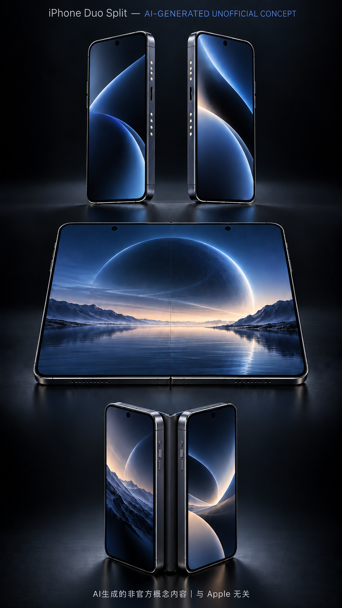

# iPhone Duo Split 产品概念方案 v1.2

> [!IMPORTANT]
> **AI-GENERATED UNOFFICIAL CONCEPT · AI生成的非官方概念内容｜与 Apple 无关**
>
> **重要声明：本方案及其全部文字、名称、效果图、结构图、界面图、参数和功能描述均由 AI 生成，仅用于概念讨论与创意展示。全部内容属于非官方概念，与 Apple Inc. 无关，未经 Apple 发布、授权或认可，不代表任何真实产品、技术实现或上市计划。**
>
> 本文出现的 “iPhone”“Apple” 等名称仅用于说明概念所设想的产品生态和兼容方向，相关商标归其权利人所有。完整声明见 [DISCLAIMER.md](DISCLAIMER.md)。

| 项目 | 内容 |
| --- | --- |
| 版本 | v1.2 |
| 状态 | 概念方案，待审核 |
| 整理与发布 | 邹志华 (Zou Zhihua) |
| 首次公开时间 | 2026-09-26（UTC，以本仓库 Git 提交时间为准） |
| 版权 | © 2026 邹志华 (Zou Zhihua)。文字按 [CC BY-NC-ND 4.0](LICENSE.md) 授权，详见 [LICENSE.md](LICENSE.md) |
| 时间戳与文件指纹 | 见 [PROVENANCE.md](PROVENANCE.md)（SHA-256 + Git 提交记录） |

*图：AI 生成的非官方概念内容，与 Apple 无关。画面展示分离、近乎无缝合并及折叠三种状态。*

---

## 1. 一句话定义

两台分别承载工作与生活的完整手机，平时可以物理分离；磁吸合并后，自动成为一台大屏、高性能、四卡协同的个人超级终端。

它不是“一台手机拆成两半”，也不是“两个人共享两台设备”。从购买、绑定、权限到日常使用，左右两台设备始终只服务于同一个用户。

## 2. 产品名称

- 暂定英文名：iPhone Duo Split
- 中文概念名：双生体手机
- 项目代号：Twin
- 核心表达：Separate your worlds. Unite your power.

名称可在后续传播阶段更换。目前重点是先验证产品逻辑，而不是确定品牌名称。

## 3. 产品定位

### 3.1 目标用户

第一目标用户不是普通大众，而是愿意为效率、隐私和多身份管理支付高溢价的单人高需求用户：

- 企业老板、创业者和高级管理者；
- 同时管理多个团队、项目或公司的人；
- 工作和生活需要严格分离的人；
- 同时持有境内、境外、工作、私人号码的跨境人士；
- 高频处理消息、会议、文件、审批和支付的专业人士；
- 对数据隔离、通信稳定和移动办公有较高要求的人。

### 3.2 用户真正需要解决的问题

这类用户往往已经在使用两台手机，但体验是割裂的：

1. 两台设备需要分别充电、登录、查找和携带；
2. 微信、邮件、会议、文件和验证码分散在不同设备；
3. 两台设备之间复制信息、传文件和切换耳机很麻烦；
4. 工作与生活需要隔离，但在必要时又需要协同；
5. 多个电话号码的流量、来电、短信和默认线路难以管理；
6. 需要大屏处理任务时，还要额外携带平板或电脑。

本产品不要求用户放弃“两台手机”，而是把两台手机变成一套系统。

## 4. 核心产品原则

### 原则一：分离是真分离

左右两条机身都必须拥有独立运行所需的完整硬件，包括屏幕、处理器、电池、基带、摄像头、扬声器、麦克风、安全芯片和存储。

拆开后，工作机和生活机都能独立完成通信、支付、导航、拍照、办公和应用运行，不依赖另一台设备。

### 原则二：合并必须无感

磁吸合并不能只是“把两块屏幕摆在一起”。设备需要自动完成：

- 身份验证；
- 屏幕拓展；
- 输入设备统一；
- 通知汇总；
- 四条通信线路接管；
- 跨设备剪贴板和文件挂载；
- 电量池合并；
- 当前任务和窗口恢复。

从吸附到可操作，目标时间应低于 1 秒，不要求用户进入设置或重新登录。

### 原则三：合并不等于混在一起

工作数据和生活数据在合并状态下仍属于两个独立安全域。用户获得的是统一操作体验，而不是把所有数据复制到同一个空间。

### 原则四：以单人为中心

两台设备绑定同一位所有者。系统围绕“一个人拥有多个身份和场景”设计，而不是围绕设备共享设计。

## 5. 产品形态

### 5.1 双机结构

产品由三个部分组成：

| 组件 | 定位 | 独立能力 |
| --- | --- | --- |
| Life Blade | 生活机 | 私人号码、社交、消费、娱乐、健康数据 |
| Work Blade | 工作机 | 工作号码、企业应用、会议、审批、敏感文件 |
| Smart Spine | 可拆卸智能转轴 | 磁吸定位、高速数据、电力互联、0–360°悬停 |

Life Blade 和 Work Blade 都是完整手机。“Life”和“Work”只是系统默认配置，用户也可以重新定义为“公司A/公司B”“境内/境外”或“主业务/投资业务”。

### 5.2 三种物理状态

**A. 分离状态**

- 两台手机独立运行；
- 各自保持独立桌面、通知、网络和数据；
- 可分别放在办公室和随身携带；
- 系统通过端到端加密维持必要的状态同步。

**B. 平铺合并状态**

- 两块屏幕组成接近 8 英寸的大屏；
- 两侧内边框向机身后方回缩，屏幕玻璃以发丝级接缝对接；
- 正面不出现传统双边框、粗黑中缝或外露金属转轴；
- 光学桥接层对接缝区域进行像素延展和亮度补偿，使连续内容在正常观看距离下接近一块完整屏幕；
- 适合多任务、文档、会议、数据看板和长信息处理；
- 可选择“双域并排”或“统一画布”。

**C. 折叠状态**

- 通过 Smart Spine 完成 0–360°翻折；
- 可使用帐篷、半开、背折和桌面支架形态；
- 折叠后优先显示用户当前所在安全域的界面。

## 6. 自动合并体验

### 6.0 零边框对接结构

合并结构采用“隐藏式磁吸内轨 + 回缩边框 + 光学桥接层”的概念设计：

1. 分离状态下，左右设备的内侧边缘保留完整防护边框和隐藏式对接触点；
2. 设备靠近后，磁吸内轨先完成定位和锁定；
3. 内侧防护边框向后方及机身内部回缩，让两块屏幕玻璃移动到同一显示平面；
4. Smart Spine 从背部承受结构应力，因此平铺状态下正面看不到转轴；
5. 一层微棱镜光学桥接材料覆盖发丝级物理接缝，对边缘像素进行折射、延展和亮度校正；
6. 系统同步校准两块面板的色温、刷新率和亮度，形成连续画布。

该设计追求的是“视觉近乎无缝”，而不是宣称两块独立屏幕在物理上不存在接缝。概念目标为正面可见缝宽低于 0.3mm，最终数值需要通过工程样机验证。

### 6.1 合并触发流程

1. 两台设备接近，超宽带芯片识别已绑定设备；
2. 磁吸结构完成物理对齐；
3. 安全芯片进行一次硬件级双向认证；
4. Smart Spine 建立高速有线连接；
5. 系统读取两台设备的前台任务、通知和通信状态；
6. 自动恢复用户上一次使用的合并布局；
7. 两块屏幕、电池和输入设备表现为一个整体。

只有绑定同一所有者并通过本地生物识别的设备才能进入完整合并模式。其他同型号设备即使物理吸附，也只能充电，不能读取数据。

### 6.2 默认合并界面

默认采用“双域并排”布局：

- 左侧为工作域；
- 右侧为生活域；
- 中央任务栏统一展示时间、电量、四条线路和设备状态；
- 工作通知使用冷色标识，生活通知使用暖色标识；
- 跨域拖动内容时，系统明确提示数据将离开原安全域。

### 6.3 统一画布模式

用户可主动将某个可信应用扩展到两块屏幕，例如：

- 在大屏上阅读和批注文档；
- 视频会议同时显示参会者、材料和会议纪要；
- 查看经营数据、交易终端或多窗口工作台；
- 一侧查看邮件，另一侧生成回复；
- 一侧运行主任务，另一侧固定AI助手。

统一画布是应用级授权，不意味着两个安全域永久打通。

### 6.4 自动拆分流程

用户拆开设备时，系统根据四条规则分配任务：

1. 工作应用回到 Work Blade；
2. 生活应用回到 Life Blade；
3. 跨屏应用留在用户当前握持的主设备上；
4. 未保存内容先完成本地快照，再恢复为单屏布局。

通话、导航、音乐、下载和文件保存不能因为拆分而中断。

## 7. 工作与生活双域系统

### 7.1 数据隔离

两台设备分别维护独立的：

- 加密存储空间；
- 应用登录状态；
- 通讯录与通话记录；
- 照片和文件；
- VPN、企业证书和MDM策略；
- 支付与身份凭证。

用户可以选择允许同步的内容，例如日历忙闲状态、跨域来电提醒、指定剪贴板内容和经过批准的文件。

### 7.2 统一但不混乱的通知中心

合并后，所有通知进入一个通知中心，但保留来源域、号码和优先级。

系统支持：

- 老板模式：只显示重要联系人、审批和紧急事项；
- 深度工作模式：工作域开放，生活域仅保留紧急来电；
- 下班模式：工作域只保留白名单通知；
- 飞行模式：根据所在国家自动调整四张卡和漫游策略。

### 7.3 AI任务编排

设备端AI可以在不突破权限边界的前提下协助用户：

- 汇总两边的待办，但不泄露受保护内容；
- 识别重复会议和时间冲突；
- 根据联系人和时间自动选择回复身份；
- 将工作文件保存到工作域，将私人照片保存到生活域；
- 在用户确认后执行跨域复制或转发。

## 8. 四卡通信系统

### 8.1 线路结构

每条 Blade 支持两个SIM/eSIM配置，整套设备最多管理四条线路：

| 线路 | 默认用途示例 |
| --- | --- |
| Line 1 | 私人主号 |
| Line 2 | 私人海外号 |
| Line 3 | 工作主号 |
| Line 4 | 公司或商务海外号 |

产品目标为“四卡四待、双路并发通信”。四条线路可以同时待机，但同时进行的高带宽蜂窝任务数量需要根据基带、天线和当地运营商能力确定。

### 8.2 智能线路中心

系统根据以下规则自动选择线路：

- 联系人身份；
- 所属应用或安全域；
- 用户所在国家和漫游费用；
- 当前信号质量；
- 企业通信政策；
- 用户设置的优先级。

拨号或发送短信前，界面仍会清楚显示即将使用的身份，避免用私人号码联系客户或用工作号码处理生活事务。

### 8.3 合并与分离时的通信行为

- 合并时：四条线路进入统一线路中心，由任意一侧接听和管理；
- 分离时：号码默认回到其所属设备；
- 设备不在身边时：用户可以授权另一台设备接收加密的来电提醒，但敏感短信和验证码默认不跨域转发；
- 某条线路无信号时：系统可以建议使用另一条线路的数据通道，但不擅自改变拨出身份。

## 9. 硬件构想

> 以下参数属于**概念目标**，不是已经验证的工程规格，全部**待工程验证**。

| 项目 | 概念目标 |
| --- | --- |
| 单条屏幕 | 约 5.4 英寸窄比例 LTPO OLED |
| 合并显示面积 | 约 7.8–8.0 英寸 |
| 刷新率 | 1–120Hz 自适应 |
| 单条厚度 | 约 6.0–6.5mm |
| 整套重量 | 约 240–270g |
| 单条电池 | 约 2800–3200mAh |
| 合并总电量 | 约 5600–6400mAh |
| 数据互联 | Smart Spine 40Gbps 级有线连接 |
| 无线发现 | UWB + Bluetooth |
| 合并结构 | 隐藏式磁吸内轨、回缩边框、光学桥接层 |
| 转轴 | 背置隐藏式、可拆卸、0–360°、多角度悬停 |
| 蜂窝能力 | 每条设备独立基带，合计四线路管理 |
| 安全 | 双安全芯片、硬件绑定、跨域授权日志 |

### 9.1 算力策略

两台设备各自拥有完整处理器。合并后不是简单叠加跑分，而是采用任务级调度：

- 主设备负责当前前台应用和统一界面；
- 另一台设备负责后台任务、AI推理、会议转写或媒体处理；
- 高负载任务可以拆分到两台设备，但应用必须经过适配；
- 系统优先降低延迟和功耗，不宣传不现实的“性能直接翻倍”。

### 9.2 电量策略

- 合并后展示一个总电量，同时允许查看两块电池状态；
- 系统自动平衡耗电，避免其中一台提前关机；
- 用户即将拆分时，优先把两台设备充到接近的电量；
- 在紧急情况下，一台设备可以通过 Smart Spine 为另一台补电；
- 两台设备可以合并进行一次有线或无线充电。

## 10. 关键使用场景

**场景一：老板的一天**

用户通勤时只使用 Life Blade 处理私人通信，Work Blade 保持静默同步。进入办公室后将两台设备合并，系统自动恢复工作布局：左侧是企业微信、邮件和审批，右侧是日历、AI助手和经营数据。下班拆开后，工作应用回到 Work Blade，Life Blade 不继续显示工作内容。

**场景二：跨境商务**

用户同时拥有中国内地、新加坡、香港和私人备用号码。到达不同地区后，系统根据漫游费用和网络质量切换数据线路，但客户看到的拨出号码仍保持一致。合并后四条线路统一管理，避免漏接重要电话。

**场景三：高强度移动办公**

在机场或车辆中，用户将设备平铺为大屏，一侧参加视频会议，另一侧查看材料、记录事项和调用AI助手。会议结束后拆开，会议纪要自动保存到工作域，私人设备不保留企业文件。

**场景四：多业务身份管理**

创业者可以把两个安全域定义为“主公司”和“投资/副业”。合并时统一查看日程和重要通知，发送消息、拨打电话或分享文件时仍明确显示当前身份。

## 11. 与普通折叠屏和双持手机的区别

| 方案 | 两台独立运行 | 大屏协同 | 工作生活物理隔离 | 四线路统一管理 |
| --- | :---: | :---: | :---: | :---: |
| 普通折叠屏 | 否 | 是 | 弱 | 弱 |
| 两台普通手机 | 是 | 否 | 是 | 否 |
| 手机 + 平板 | 部分 | 部分 | 部分 | 否 |
| Duo Split | 是 | 是 | 是 | 是 |

Duo Split 的价值不在“又多一块屏”，而在于第一次把双持手机、折叠大屏和身份隔离整合成同一套产品。

## 12. 商业定位

### 12.1 产品级别

- 超高端个人生产力设备；
- 首发不追求大众销量；
- 与旗舰手机加小尺寸平板的总价格竞争；
- 重点售卖效率、身份管理和数据安全，而不是屏幕尺寸。

### 12.2 潜在版本

- Duo Split Executive：面向老板和管理者；
- Duo Split Enterprise：支持企业MDM、审计和远程擦除；
- Duo Split Global：强化多地区通信和卫星能力。

早期不建议推出低价版本。双处理器、双基带和双电池决定了它必须先服务高价值用户。

## 13. MVP验证路线

### 阶段一：软件原型

先使用两台现有手机和一个模拟磁吸配件验证：

- 自动识别合并与分离；
- 双域桌面；
- 通知汇总；
- 任务归属和恢复；
- 四线路管理界面；
- 跨域文件授权流程。

这一阶段不追求真正无缝屏幕，重点验证用户是否愿意长期使用“双域合并”的交互方式。

### 阶段二：工程样机

- 定制两条超窄手机；
- 完成磁吸结构和高速数据连接；
- 验证合并延迟、发热、续航和握持感；
- 测试不同拆分动作下的任务连续性。

### 阶段三：高端用户测试

邀请老板、创业者、跨境商务人士和高强度移动办公者连续使用 30 天，重点观察：

- 是否减少携带第三台设备；
- 工作与生活切换是否更清晰；
- 合并功能是否每天被主动使用；
- 四线路是否降低漏接和误用号码；
- 用户能否接受重量、价格和中缝。

## 14. 核心成功指标

- 合并识别成功率 ≥ 99.9%；
- 从吸附到可操作 ≤ 1 秒；
- 拆分过程中前台任务中断率 < 0.1%；
- 合并用户日均主动使用 ≥ 3 次；
- 目标用户携带第三台移动设备的比例明显下降；
- 号码误用、重要通知漏看和跨设备传文件次数明显下降；
- 30 天后仍持续使用工作/生活双域的用户比例 ≥ 70%。

## 15. 主要风险与取舍

### 15.1 屏幕接缝与光学失真

两台可完全拆分的手机无法共享一整块柔性屏，因此物理接缝无法真正消失。本方案通过回缩边框和光学桥接层把粗黑中缝压缩为发丝级接缝，但仍可能产生折射、触控死区、耐磨损和色差问题。对外只能描述为“视觉近乎无缝”，不能声称“物理完全无缝”。

### 15.2 重量与厚度

两套完整硬件必然比单台手机更重。产品必须让用户感受到它替代了“两台手机加一台小平板”，而不是把它与单台旗舰手机比较重量。

### 15.3 续航与发热

双基带、双屏和跨设备协同会增加功耗。合并后需要动态关闭重复无线模块，并把后台任务分配给温度更低的一侧。

### 15.4 系统复杂度

真正的壁垒不是磁吸结构，而是系统级的身份、任务、通信和权限编排。若合并过程需要频繁设置，产品价值会迅速下降。

### 15.5 数据边界

“自动合并”与“工作生活隔离”天然存在冲突。设计必须坚持：界面可以统一，数据不能未经授权跨域。

### 15.6 价格

产品相当于两台旗舰手机加一个精密转轴，初期价格可能非常高。只有高需求用户节省的时间、设备数量和管理成本足够大时，商业逻辑才成立。

## 16. 当前最需要验证的五个问题

1. 用户究竟需要“两台完全独立的手机”，还是一台主机加一个可独立使用的轻量副机？
2. 合并时应该默认“双域并排”，还是直接进入统一大屏？
3. 低于 0.3mm 的可见接缝及轻微光学失真能否被目标用户接受？
4. 用户愿意用多少重量和价格换取工作生活物理隔离？
5. 四卡是高频核心需求，还是对目标用户有吸引力但使用频率较低的附加能力？

## 17. 概念图与对外材料规范

为避免让公众误认为真实苹果产品，所有对外文件必须遵守以下规则：

- 每一张概念图顶部或底部必须出现“UNOFFICIAL CONCEPT”；
- 每一张概念图还必须明确标注其 AI 生成属性，英文统一使用“AI-GENERATED UNOFFICIAL CONCEPT”；
- 面向中文平台发布时，必须同时出现“AI生成的非官方概念内容｜与 Apple 无关”；
- GitHub README、方案首页和演示文档首页必须保留完整非官方声明；
- 图片文件名、标题或说明不得使用“官方曝光”“苹果即将发布”等误导性表达；
- 不使用 Apple 官方 Logo，不仿制发布会页面，不伪造发布日期、价格或官方参数；
- 所有未验证参数必须标记为“概念目标”或“待工程验证”。

## 18. 产品结论

iPhone Duo Split 的本质不是折叠屏创新，而是个人多身份计算系统。

传统折叠屏解决的是“一台手机如何获得更大的屏幕”；Duo Split 解决的是“一个高需求用户如何同时管理工作、生活、多个号码和多个任务，并在需要时把它们自动组合成一个高效工作台”。

它最重要的产品承诺可以归纳为三句话：

1. 分开时，边界清楚。
2. 合并时，体验统一。
3. 无论分合，任务不中断。

---

> [!IMPORTANT]
> **再次声明：本文件及其配图均由 AI 生成，仅用于概念讨论。全部内容为非官方概念，与 Apple Inc. 无关。**

- 版本：v1.2
- 状态：概念方案，待审核
- 下一步：根据审核意见确定硬件结构、交互原型和视觉设计方向。

© 2026 邹志华 (Zou Zhihua) · 首次公开 2026-09-26 (UTC) · 文字按 CC BY-NC-ND 4.0 授权 · “iPhone”“Apple” 为 Apple Inc. 的商标，本仓库与 Apple Inc. 无任何关联。
