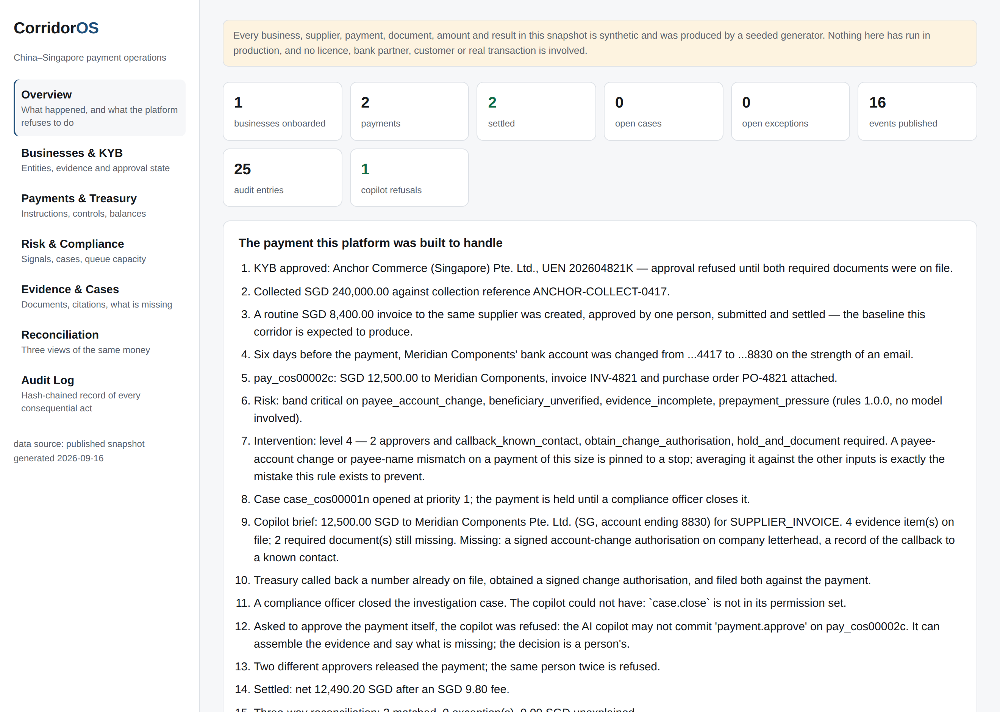

# CorridorOS

**China–Singapore Cross-border Payment Operations Platform**

A Chinese company opens a Singapore entity. It has to complete KYB, collect SGD,
convert currency, pay suppliers, pass risk checks, survive an AML investigation,
settle and reconcile — and be able to show, for every movement of money and
every compliance decision, what evidence was used and who was allowed to decide.

That is one operating problem. CorridorOS is four projects of mine rebuilt into
one system around it.

> ### ⚠️ Every business, supplier, payment, document, amount and result here is synthetic
> Produced by a seeded generator. CorridorOS has never run in production, holds
> no licence, has no bank or provider partner, and has never processed a real
> payment for anyone. See [Truth and limitations](docs/TRUTH_AND_LIMITATIONS.md).



## The payment this system exists for

A Shenzhen company's Singapore entity pays a supplier **SGD 12,500**. The
supplier changed bank account six days ago.

```
business.submitted → business.approved        KYB refuses to approve on absent documents
payment.created                               SGD 12,500, invoice INV-4821, purchase order PO-4821
beneficiary.changed                           account ...4417 → ...8830, six days earlier
risk.assessed                                 4 deterministic signals, band critical, no model
intervention.required                         level 4: two approvers and a callback
case.opened                                   priority 1 — the payment is held
   ⟶ someone asks the copilot to approve it. Refused, and the refusal is in the audit log.
payment.approved                              two different people; the same person twice is refused
payment.submitted → payment.settled           net SGD 12,490.20 after a SGD 9.80 fee
                                              three-way reconciliation, 25-entry chain verifies
```

Run it: `python -m corridoros.cli demo`. Every line above is a call into the
platform, and the refusals in the middle are real — remove the callback and the
approval raises.

## What the four projects became

| Was | Is now | What changed |
| --- | --- | --- |
| **[China-to-Singapore Payment Corridor](../portfolio/china-to-singapore-payment-corridor.md)** — two Markdown documents, no code | `payments/` — **Payment Core** | The blueprint was implemented: KYB, collection, a double-entry ledger, FX with expiry, the payout lifecycle, settlement, three-way reconciliation |
| **CrossBorder AML RiskOps** | `risk/` + `core/audit.py` | Reads the platform's events instead of generating its own world; its money arithmetic, hash chain and guardrails became shared infrastructure |
| **WealthGuard Proofline** | `evidence/` — **Evidence & Policy Copilot** | Its method kept, its subject changed: checksummed, located, citable evidence for KYB, payment review and investigations instead of investment research |
| **ThinkBeforeClick FinSafe** | `intervention/` — **Pre-payment Intervention Engine** | Same ladder, real inputs: a payment instruction, a risk assessment and the state of the evidence, rather than pasted text |

The four source repositories are unchanged. This is the system they add up to,
not a fifth project beside them. See [Migration](docs/MIGRATION.md) for the
identifier mapping and what was kept, adapted and dropped.

## The design rule

> **Rules decide. The AI explains and organises evidence. A person approves.
> Everything leaves a trace.**

Six things the copilot may do: assemble a packet, summarise a case, name what is
missing, answer with citations, draft a request for a human to send, abstain.

Six it cannot: approve a KYB case, change the ledger, execute FX, submit or
release a payment, clear an AML alert, close an investigation or an exception.

That second list is enforced four independent ways — the permission matrix
refuses it, `ApprovalDecision` refuses it as an author, the audit log refuses it
and records the attempt, and its output object **has no field a decision could
be written into**. See [AI boundaries](docs/AI_BOUNDARIES.md).

## Architecture

```
                    apps/web  — one console, seven sections
                          │
                    apps/api  — FastAPI, projections only
   ┌───────────────┬───────────────┬───────────────┬────────────────────┐
   │ payments      │ risk          │ evidence      │ intervention       │
   └───────────────┴───────────────┴───────────────┴────────────────────┘
   ┌──────────────────────────────────────────────────────────────────┐
   │ core — 11 objects · 12 events · identifiers · money · RBAC · audit │
   └──────────────────────────────────────────────────────────────────┘
```

Every module imports `core`. **No module imports another module.** They meet at
the event bus, which is what makes this one platform rather than four packages
sharing a repository. [Architecture](docs/ARCHITECTURE.md) ·
[Data dictionary](docs/DATA_DICTIONARY.md) ·
[Event contracts](docs/EVENT_CONTRACTS.md)

Eleven objects: `BusinessProfile`, `Beneficiary`, `CollectionIntent`,
`PaymentInstruction`, `RiskAssessment`, `EvidenceItem`, `ReviewCase`,
`ApprovalDecision`, `SettlementRecord`, `ExceptionCase`, `AuditEvent`.

Twelve events: `business.submitted`, `business.approved`, `payment.created`,
`beneficiary.changed`, `risk.assessed`, `intervention.required`, `case.opened`,
`payment.approved`, `payment.submitted`, `payment.settled`,
`reconciliation.failed`, `exception.resolved`.

## The seven scenarios

`tests/e2e/test_scenarios.py` — these are the specification, not illustrations.

| # | Scenario | The property asserted |
| --- | --- | --- |
| 1 | Normal payment | Settles with one approver and no friction; the ledger balances |
| 2 | Beneficiary account change | Level 4, two **different** approvers, a callback; approval raises while a verification is outstanding |
| 3 | Duplicate payment | A retry returns the first payment — **zero** second payouts — and the attempt is recorded |
| 4 | Suspicious transaction | A case opens, holds the payment, and the copilot cannot close it |
| 5 | Expired FX quote | Fails closed: nothing posted, no silent refresh, requote required |
| 6 | Duplicated / out-of-order webhook | A replay changes nothing; an early lifecycle event is quarantined, not applied |
| 7 | Reconciliation mismatch | A typed exception with an owner and a due time; the run **cannot** be marked reconciled while a difference is unexplained |

65 tests total, `python -m pytest`, no third-party dependency in the domain layer.

## Running it

```bash
pip install -e '.[dev]'
python -m corridoros.cli demo          # the flagship story
python -m corridoros.cli boundary      # what the copilot may and may not do
python -m corridoros.cli verify-audit  # recompute the hash chain
python -m pytest                       # the seven scenarios and the rest

python -m corridoros.cli snapshot      # data/snapshot.json
cd apps/web && npm install && npm run build   # the console, static
```

With `uvicorn apps.api.main:app` running, the console reads live objects;
without it, the published snapshot. Same shapes, same screens — the static demo
cannot drift away from the code that produced it.

## What is not here yet

Phase P2 ports CrossBorder RiskOps' twenty transaction-integrity rules and six
AML typologies onto this event stream, with the analyst workbench and its queue
evaluation. Phase P3 brings WealthGuard's 13 official documents and 1,714
checksummed evidence chunks into the evidence register. The console says which
signal set it is currently running rather than implying the AML layer has
already arrived.

Figures inherited from the four source projects are labelled with the project
and dataset that produced them and are not restated as CorridorOS results.
[Evaluation](docs/EVALUATION.md) · [Demo script](docs/DEMO_SCRIPT.md)

---

**中文说明:** [README.zh-CN.md](README.zh-CN.md)
