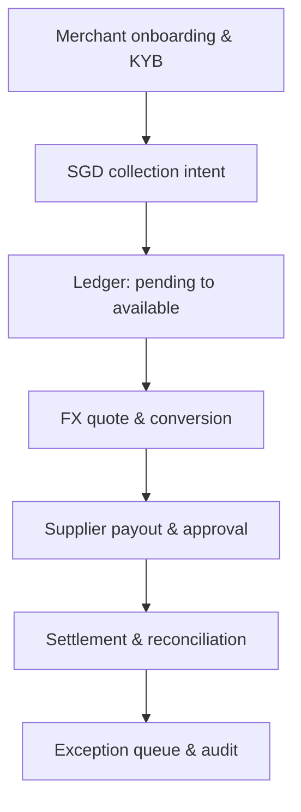

# China-to-Singapore Payment Corridor Blueprint

**A product case for a China-based merchant entering Singapore**  
Cross-border FinTech Product · Payments · KYB/AML · FX · Treasury · Reconciliation

> Portfolio case only. The company, users, volumes, prices, service-level targets, and operating results below are synthetic. Regulatory references are starting points for product discovery, not legal advice. A licensed institution or qualified adviser must determine the actual regulated perimeter.

## The product question

A Shenzhen-based B2B commerce platform is opening a Singapore entity. Its customers want to pay in SGD, suppliers want predictable settlement, finance wants one reconciled view of money, and compliance needs evidence before funds move.

The tempting answer is “add more payment methods.” The actual product problem is larger:

> **How can the company collect, convert, pay out, and reconcile money across a China–Singapore corridor without making finance, operations, and compliance stitch the truth together by hand?**

This blueprint treats the corridor as one operating product rather than a collection of disconnected integrations.

## Who it is for

| User | Job to be done | Failure they care about |
| --- | --- | --- |
| Merchant finance lead | Know what was collected, converted, paid, and settled | A dashboard balance that cannot be tied to the ledger or bank statement |
| Treasury operator | Convert and move funds with visible rates, fees, and timing | FX slippage or a payout sent from the wrong balance |
| Payment operations analyst | Resolve failed, duplicated, delayed, or unmatched items | Repeated retries creating duplicate money movement |
| Compliance reviewer | Understand the entity, counterparties, purpose, and evidence | A payment progressing while required information is missing |
| Integration engineer | Integrate once and receive stable lifecycle events | Webhooks arriving twice, out of order, or without an idempotency key |

## Why Singapore first

The first release deliberately models one corridor and one local-currency collection experience. Singapore offers a concrete product surface: PayNow Corporate lets eligible entities receive and send SGD using a UEN linked to a participating bank or major payment institution account, while FAST provides the underlying near-instant SGD transfer rail. Singapore's Payment Services Act regulates defined payment services and requires the operating model to be checked against the relevant licensing perimeter.

The regional architecture should be reusable, but the product must not pretend that one Singapore flow can simply be copied into every Southeast Asian market. Local rails, entity requirements, settlement models, dispute processes, data fields, and regulatory obligations become corridor configuration—not hidden assumptions in shared code.

## Product scope

### MVP: make one corridor operationally complete

1. **Business onboarding and KYB case management**
   - entity profile, ownership, expected activity, products, counterparties, and source-of-funds evidence;
   - explicit states: `draft → submitted → needs_information → approved / rejected`;
   - evidence expiry and change-triggered review rather than a one-time checkbox.

2. **SGD collection**
   - PayNow Corporate / bank-transfer collection through a licensed partner;
   - virtual account or structured reference mapping where supported;
   - a unique collection intent so incoming money can be attributed without guessing.

3. **Multi-currency ledger**
   - available, pending, reserved, and payable balances kept separately;
   - all money stored as integer minor units with currency-specific exponents;
   - immutable journal entries; corrections occur through reversal, never silent editing.

4. **FX quote and conversion**
   - quote ID, source/target currency, rate, fee, expiry, and guaranteed output displayed before confirmation;
   - expired quotes fail closed and require requoting;
   - spread, explicit fee, and realised conversion outcome are separately observable.

5. **Supplier payout**
   - beneficiary verification, payment purpose, supporting document, approval policy, and idempotent submission;
   - deterministic state machine: `created → awaiting_approval → submitted → accepted → settled / failed / returned`;
   - no retry may create a second payout for the same business instruction.

6. **Reconciliation and exception workbench**
   - product ledger, provider event, and bank/settlement statement compared as three independent views;
   - differences classified by timing, fee, FX, duplicate, missing record, amount, beneficiary, and state;
   - every exception has an owner, due time, next action, and audit trail.

### Not in the MVP

- direct access to payment rails without a licensed bank or payment-service partner;
- consumer remittance, credit, BNPL, card issuing, crypto conversion, or tax determination;
- automatic approval of KYB/AML cases by a language model;
- claims that a Singapore configuration satisfies another market's requirements.

## End-to-end flow



The state of money and the state of compliance are separate. An entity may be approved while an individual payout still needs information; a transfer may be technically accepted while settlement remains unreconciled.

## The operating model

### Build versus partner

| Capability | Product should own | Product should integrate |
| --- | --- | --- |
| Merchant experience | onboarding journey, money views, approvals, evidence requests, exceptions | identity/company-data checks where appropriate |
| Payment orchestration | intent IDs, routing policy, lifecycle state, retry/idempotency rules | bank/PSP connectivity and rail access |
| Ledger and reconciliation | internal double-entry truth, mapping, exception workflow | provider reports and bank statements |
| FX experience | quote comparison, disclosure, expiry, confirmation, outcome tracking | liquidity and executable quotes |
| Compliance workflow | case states, evidence packet, decision authority, audit | screening/data services and licensed compliance operations |

The product advantage is not pretending to own every regulated or capital-intensive layer. It is giving the merchant one coherent operating surface while keeping provider boundaries and decision authority explicit.

## Control points

| Risk | Product control | Human authority |
| --- | --- | --- |
| Entity information incomplete | required evidence schema; `needs_information` state | compliance approves or rejects onboarding |
| Duplicate collection event | provider event ID plus product intent ID; idempotent posting | operations resolves conflicting provider evidence |
| Stale FX quote | expiry checked at execution; no silent refresh | treasury accepts a new quote |
| Wrong beneficiary | beneficiary confirmation, change cooldown, risk-based approval | authorised approver releases payout |
| Duplicate payout | business instruction ID and idempotency key | operations investigates ambiguous retry |
| Out-of-order webhook | monotonic lifecycle rules and quarantined illegal transition | operations reviews provider conflict |
| Ledger/statement mismatch | three-way reconciliation and typed exceptions | finance owns adjustment/reversal |
| AI overreach | AI output has no action field; citations must resolve | licensed/authorised person makes consequential decision |

## Where AI belongs

AI is a workflow assistant, not the owner of money movement.

It may:

- assemble an onboarding or exception brief from existing evidence;
- translate provider error text into a proposed operational reason code;
- explain why an item is in the queue and identify missing documents;
- answer a reviewer’s follow-up question with citations to the case packet;
- draft a customer request for missing information;
- abstain when evidence conflicts or is incomplete.

It may not:

- approve an entity or beneficiary;
- change a ledger balance;
- execute FX or submit/release a payout;
- clear an AML alert or close an exception;
- invent a regulatory determination.

These restrictions belong in schemas, permissions, and audit logic—not only in a prompt.

## Core objects and API surface

| Object | Minimum product identifiers |
| --- | --- |
| `BusinessProfile` | `business_id`, `entity_country`, `uen`, `review_status`, `evidence_version` |
| `CollectionIntent` | `intent_id`, `business_id`, `currency`, `expected_amount`, `reference`, `expires_at` |
| `LedgerEntry` | `entry_id`, `account_id`, `currency`, `minor_units`, `direction`, `event_id` |
| `FxQuote` | `quote_id`, `sell_currency`, `buy_currency`, `rate`, `fee_minor`, `expires_at` |
| `PayoutInstruction` | `instruction_id`, `beneficiary_id`, `purpose`, `approval_state`, `idempotency_key` |
| `SettlementRecord` | `settlement_id`, `provider_id`, `gross`, `fee`, `net`, `value_date` |
| `ExceptionCase` | `case_id`, `type`, `evidence_refs`, `owner`, `due_at`, `resolution_code` |

Example payout request:

```json
{
  "business_instruction_id": "PO-2026-004821",
  "source_balance": "SGD-OPERATING",
  "beneficiary_id": "BEN-0193",
  "amount": { "currency": "SGD", "minor_units": 1250000 },
  "purpose_code": "SUPPLIER_INVOICE",
  "evidence_ids": ["INV-4821", "PO-4821"],
  "idempotency_key": "b240f2d8-3b9f-4a4b-a2db-f2a94ad4d875"
}
```

## Success metrics

One headline metric is insufficient. The product has to improve merchant outcomes without hiding the cost in operations or risk.

| Dimension | MVP metric | Guardrail |
| --- | --- | --- |
| Activation | median time from complete KYB submission to collection-ready | % cases reopened for missing/incorrect evidence |
| Collection | % incoming funds automatically attributed to an intent | unmatched funds aged beyond SLA |
| Treasury | quote-to-conversion completion | expired-quote execution: must be 0 |
| Payout | straight-through processing rate for eligible payouts | duplicate payouts: must be 0 |
| Reconciliation | % records reconciled without manual action | unexplained ledger difference: must be 0 |
| Operations | exceptions resolved within SLA | queue above staffed capacity shown, never labelled cleared |
| Compliance | complete evidence trace for every decision | AI-committed consequential decisions: must be 0 |

## Twelve-week product plan

| Weeks | Deliverable | Exit criterion |
| --- | --- | --- |
| 1–2 | merchant interviews, corridor assumptions, partner/RACI map | top five failure modes and decision owners agreed |
| 3–4 | lifecycle models, ledger contract, KYB evidence schema | illegal transitions and authority boundaries testable |
| 5–7 | sandbox collection, quote, payout, and webhook integrations | replay produces the same balances and states |
| 8–9 | reconciliation engine and exception queue | every synthetic difference has an owner and reason code |
| 10 | AI evidence brief behind schema/citation gates | no action field; unsupported citations rejected |
| 11 | seeded failure drills and operational runbook | duplicate, timeout, return, and stale-FX paths exercised |
| 12 | pilot readiness review | product, finance, operations, compliance, and engineering sign-off |

## How this case connects to the portfolio

This blueprint is the market-entry and money-movement layer. Three implemented projects test the hard parts underneath it:

1. **CrossBorder RiskOps** — payment lifecycle, AML alert prioritisation, evidence-grounded investigation, and explicit human authority.
2. **WealthGuard Proofline** — financial evidence retrieval, one-question clarification, policy boundaries, and citation/version governance.
3. **ThinkBeforeClick FinSafe** — intervention at the moment a consumer or business is about to move money, with deterministic controls over the model.
4. **China-to-Singapore Corridor Blueprint** — combines onboarding, collection, ledger, FX, payout, and reconciliation into one merchant product strategy.

Together they tell one product story: **make cross-border money movement usable, traceable, and safer—then use AI only where it improves the human workflow without acquiring hidden authority.**

## Official starting points

- [Monetary Authority of Singapore — Payment Services Act](https://www.mas.gov.sg/regulation/acts/payment-services-act)
- [MAS — Licensing for Payment Service Providers](https://www.mas.gov.sg/regulation/payments/licensing-for-payment-service-providers)
- [MAS — Types of Payment Services](https://www.mas.gov.sg/regulation/payments/licensing-for-payment-service-providers/types-of-payment-services)
- [Association of Banks in Singapore — PayNow and PayNow Corporate](https://abs.org.sg/e-payments/pay-now)
- [MAS — Cross-border Payment Linkages](https://www.mas.gov.sg/development/e-payments/cross-border-payment-linkages)
- [MAS — AML/CFT Notice for Specified Payment Services](https://www.mas.gov.sg/regulation/notices/psn01-aml-cft-notice---specified-payment-services)

## Truth and limitations

- This is a product blueprint, not a launched service.
- No user interview, partner commitment, licence, pricing agreement, transaction, or production outcome is claimed.
- The architecture is intentionally provider-agnostic; actual rail access, safeguarding, settlement, FX, data residency, sanctions, AML/CFT, consumer-protection, and reporting obligations depend on the final business and legal model.
- The next validation step is not more interface polish. It is interviewing merchant finance/operations teams and licensed providers, then testing the lifecycle and reconciliation contract against sandbox evidence.

