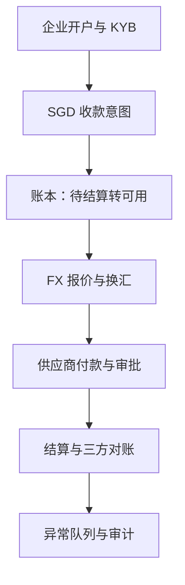

# 中国企业进入新加坡的跨境支付走廊方案

**面向中国企业进入新加坡市场的产品案例**  
跨境金融科技产品 · 支付 · KYB/AML · 外汇 · 资金管理 · 对账

> 本项目仅为求职作品集案例。公司、用户、交易规模、价格、服务时限和结果均为合成设定。监管资料仅用于产品调研起点，不构成法律或合规意见；实际业务边界必须由持牌机构或专业顾问确认。

## 产品问题

一家深圳 B2B 商业平台准备设立新加坡实体。客户希望使用 SGD 付款，供应商希望稳定收款，财务需要看清资金从收款到结算的全过程，合规团队则需要在资金移动前看到完整证据。

表面答案是“多接几个支付方式”，真实问题却是：

> **如何让企业在中国—新加坡走廊内完成收款、换汇、付款和对账，同时避免财务、运营与合规团队靠人工拼凑资金真相？**

本方案把整条走廊作为一个运营产品，而不是一组彼此割裂的接口。

## 核心用户

| 用户 | 需要完成的任务 | 最担心的失败 |
| --- | --- | --- |
| 企业财务负责人 | 知道收了多少、换了多少、付了多少、结算了多少 | 看板余额无法和账本、银行结算单对应 |
| 资金运营人员 | 看清汇率、费用和到账时间后再移动资金 | 汇率滑点或从错误余额发起付款 |
| 支付运营分析师 | 处理失败、重复、延迟和无法匹配的交易 | 重试导致同一笔钱支付两次 |
| 合规审核人员 | 看清企业、交易对手、用途和证据 | 资料不全但支付仍继续执行 |
| 接口工程师 | 一次接入并稳定接收生命周期事件 | webhook 重复、乱序或缺少幂等标识 |

## 为什么先做新加坡

第一期只做深一条走廊和一种本币收款体验。新加坡提供了明确的产品场景：符合条件的企业可以通过 PayNow Corporate，把 UEN 关联到参与银行或主要支付机构的账户，以 SGD 收付款；FAST 提供接近实时的本地 SGD 转账基础设施。与此同时，新加坡《支付服务法》对不同支付服务进行监管，实际运营模式必须先确认对应的牌照和合规边界。

区域架构可以复用，但产品不能假设新加坡流程能原样复制到所有东南亚市场。本地支付网络、实体要求、结算方式、争议处理、数据字段和监管义务都应成为“走廊配置”，而不是埋在通用代码里的默认假设。

## 产品范围

### MVP：先让一条走廊真正闭环

1. **企业开户与 KYB 案件管理**
   - 企业资料、所有权、预期交易、产品、交易对手和资金来源证据；
   - 明确状态：`草稿 → 已提交 → 待补资料 → 通过 / 拒绝`；
   - 文件到期和企业信息变化触发复核，而不是一次性打勾。

2. **SGD 本地收款**
   - 通过持牌合作方接入 PayNow Corporate / 银行转账；
   - 在合作方支持时使用虚拟账户或结构化付款附言；
   - 每笔应收款先创建唯一收款意图，避免到账后靠猜测认领。

3. **多币种账本**
   - 可用、待结算、冻结和待付款余额分开记录；
   - 金额全程使用最小货币单位整数，并支持不同币种精度；
   - 分录不可静默修改，修正必须通过冲正完成。

4. **外汇报价与换汇**
   - 确认前展示报价编号、买卖币种、汇率、费用、到期时间和保证到账金额；
   - 报价过期后必须重新询价，不可后台静默刷新；
   - 点差、显性费用和最终换汇结果分开观察。

5. **供应商付款**
   - 收款人核验、付款用途、支持文件、审批规则和幂等提交；
   - 确定性状态机：`已创建 → 待审批 → 已提交 → 已受理 → 已结算 / 失败 / 退回`；
   - 同一业务指令的重试不能产生第二笔付款。

6. **对账与异常工作台**
   - 内部产品账本、支付服务商事件、银行/结算单作为三套独立视图比对；
   - 异常按时间差、费用、FX、重复、记录缺失、金额、收款人和状态分类；
   - 每条异常都有负责人、处理时限、下一步动作和审计记录。

### MVP不包含

- 绕过持牌银行或支付机构直接接入支付网络；
- 消费者汇款、信贷、BNPL、发卡、加密货币兑换或税务判断；
- 让语言模型自动批准 KYB/AML 案件；
- 宣称新加坡配置可以满足其他市场的监管要求。

## 端到端流程

资金状态和合规状态必须分开。企业开户通过，不代表每一笔付款都无需补充信息；支付被服务商受理，也不代表结算已经完成对账。

## 自建与合作边界

| 能力 | 产品自身负责 | 接入合作方 |
| --- | --- | --- |
| 企业体验 | 开户流程、资金视图、审批、补件和异常处理 | 必要的身份/企业数据核验 |
| 支付编排 | 意图编号、路由策略、生命周期、重试与幂等 | 银行/PSP连接和支付网络能力 |
| 账本与对账 | 内部复式账本、映射、异常工作流 | 服务商报告和银行结算单 |
| FX体验 | 报价比较、披露、到期、确认和结果追踪 | 流动性与可执行报价 |
| 合规流程 | 案件状态、证据包、决策权限和审计 | 名单筛查/数据服务及持牌合规运营 |

产品的优势不是假装所有受监管或资本密集型能力都能自建，而是在明确合作方边界和决策权限的前提下，为企业提供一个一致的操作界面。

## 关键控制点

| 风险 | 产品控制 | 人工权限 |
| --- | --- | --- |
| 企业资料不完整 | 必填证据结构和“待补资料”状态 | 合规人员决定通过或拒绝 |
| 重复收款事件 | 服务商事件ID + 产品收款意图ID，幂等入账 | 运营处理服务商证据冲突 |
| FX报价过期 | 执行前检查到期时间，禁止静默刷新 | 资金人员接受新报价 |
| 错误收款人 | 收款人确认、变更冷静期、风险分级审批 | 授权审批人放行付款 |
| 重复付款 | 业务指令ID和幂等键 | 运营调查含义不明的重试 |
| webhook乱序 | 单向生命周期规则，非法跳转进入隔离区 | 运营处理服务商状态冲突 |
| 账本与结算单不一致 | 三方对账和结构化异常 | 财务负责冲正或调整 |
| AI越权 | AI输出结构不存在执行字段，引用必须可解析 | 持牌/授权人员作出关键决策 |

## AI应该放在哪里

AI是工作流助手，不是资金移动的所有者。

AI可以：

- 根据已有证据生成开户或异常案件简报；
- 把服务商错误信息映射为建议的运营原因码；
- 解释案件为什么进入队列，并指出缺少的文件；
- 依据案件材料、带引用地回答审核人员追问；
- 起草补充资料通知；
- 证据冲突或不足时主动放弃判断。

AI不可以：

- 批准企业或收款人；
- 修改账本余额；
- 执行换汇或提交/放行付款；
- 清除 AML 预警或关闭异常；
- 编造监管结论。

这些边界必须写进数据结构、权限和审计逻辑，而不是只写在提示词里。

## 核心数据对象

| 对象 | 关键标识 |
| --- | --- |
| `BusinessProfile` | `business_id`、注册地、UEN、审核状态、证据版本 |
| `CollectionIntent` | `intent_id`、企业、币种、预期金额、附言、到期时间 |
| `LedgerEntry` | 分录ID、账户、币种、最小单位金额、方向、事件ID |
| `FxQuote` | 报价ID、买卖币种、汇率、费用、到期时间 |
| `PayoutInstruction` | 指令ID、收款人、用途、审批状态、幂等键 |
| `SettlementRecord` | 结算ID、服务商、总额、费用、净额、价值日 |
| `ExceptionCase` | 案件ID、类型、证据引用、负责人、时限、解决原因码 |

## 成功指标

不能只用一个漂亮指标代表产品成功。提升商户体验的同时，不能把成本隐藏到运营或风险团队。

| 维度 | MVP指标 | 守门指标 |
| --- | --- | --- |
| 激活 | 完整KYB提交到可收款的中位时间 | 因资料错误/缺失被重新打开的比例 |
| 收款 | 自动匹配到收款意图的到账比例 | 超过SLA仍未认领的资金 |
| 资金管理 | 报价到换汇完成率 | 过期报价执行必须为0 |
| 付款 | 符合条件付款的直通处理率 | 重复付款必须为0 |
| 对账 | 无需人工处理的自动对账比例 | 无法解释的账本差额必须为0 |
| 运营 | SLA内解决的异常比例 | 超出人力容量的队列必须展示，不能伪装已清除 |
| 合规 | 每个决定的完整证据链 | AI作出的关键决策必须为0 |

## 十二周产品计划

| 周期 | 交付物 | 退出标准 |
| --- | --- | --- |
| 第1–2周 | 商户访谈、走廊假设、合作方/RACI图 | 五大失败场景及决策人达成一致 |
| 第3–4周 | 生命周期、账本契约、KYB证据结构 | 非法状态跳转和权限边界可测试 |
| 第5–7周 | 沙盒收款、报价、付款与webhook接入 | 重放事件得到相同余额和状态 |
| 第8–9周 | 对账引擎和异常队列 | 每个合成异常都有负责人和原因码 |
| 第10周 | 受结构和引用约束的AI证据简报 | 不存在执行字段，不支持的引用被拒绝 |
| 第11周 | 失败演练和运营手册 | 重复、超时、退回、FX过期路径完成测试 |
| 第12周 | 试点准备评审 | 产品、财务、运营、合规和工程共同确认 |

## 与现有作品的关系

本方案负责“市场进入与资金移动”这一层，三个已经实现的项目分别验证底层难点：

1. **CrossBorder RiskOps**：支付生命周期、AML预警排序、基于证据的调查，以及明确的人工决策权。
2. **WealthGuard Proofline**：金融证据检索、每轮一个关键澄清、政策边界和引用/版本治理。
3. **ThinkBeforeClick FinSafe**：在个人或企业即将付款时介入，由确定性规则控制干预级别。
4. **中国—新加坡支付走廊方案**：把开户、收款、账本、FX、付款和对账组合成一个完整的企业产品战略。

四个项目共同讲述同一个故事：**让跨境资金移动更好用、更可追溯、更安全；只在AI能够改善人工工作流、且不会获得隐藏权限的位置使用AI。**

## 官方资料起点

- [新加坡金融管理局（MAS）—《支付服务法》](https://www.mas.gov.sg/regulation/acts/payment-services-act)
- [MAS — 支付服务提供商牌照](https://www.mas.gov.sg/regulation/payments/licensing-for-payment-service-providers)
- [MAS — 支付服务类型](https://www.mas.gov.sg/regulation/payments/licensing-for-payment-service-providers/types-of-payment-services)
- [新加坡银行公会（ABS）— PayNow / PayNow Corporate](https://abs.org.sg/e-payments/pay-now)
- [MAS — 跨境支付连接](https://www.mas.gov.sg/development/e-payments/cross-border-payment-linkages)
- [MAS — 特定支付服务AML/CFT通知](https://www.mas.gov.sg/regulation/notices/psn01-aml-cft-notice---specified-payment-services)

## 真实性与限制

- 这是产品方案，不是已经上线的服务。
- 不宣称进行过用户访谈、获得合作方承诺或牌照，也不宣称有真实交易、定价协议或生产结果。
- 架构刻意保持服务商中立；真实业务涉及的支付网络接入、客户资金保护、结算、FX、数据驻留、制裁、AML/CFT、消费者保护和监管报告，取决于最终商业与法律模式。
- 下一步验证重点不是继续美化界面，而是访谈企业财务/运营人员和持牌服务商，再用沙盒证据测试生命周期与对账契约。
